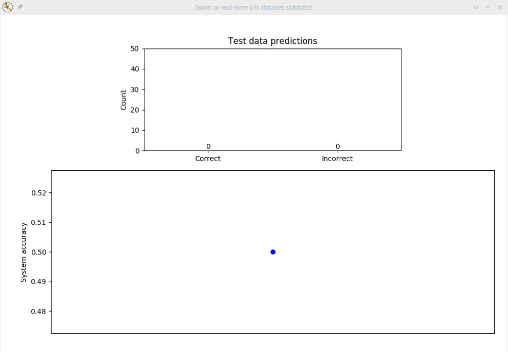

# Swim-Iris
ML example on the Iris dataset, using the Swim platform, to show how the system can be used for machine learning on real-time, streaming data

## Summary

#### Dataset
The original Iris dataset contains 150 records, which have been split into 6 batches of 25. Four of the batches are used for training and the other two are used for testing.

#### Server side
Each training batch is associated with a training agent on the server side, and each of the agents sends data rows from its batch, at random intervals.
After some initial delay, the testing agents also start sending data rows from their batches.

#### Client side
The client is written in Python and opens downlinks to both the training agents and the testing agents.
On every 5 training records received, it trains a clustering model and measures the performance of that model against the full 50 testing records.
On every testing record received from the testing agents, it uses the trained model to predict the label, and records if the prediction was correct or not.

## Running the app

#### Server (`/server`)
Run the server: `./gradlew run`

#### Client (`/client`)
Install dependencies: `pip install -r requirements.txt`
Run the client: `python main.py`

#### Visualisation (`/client`)
Install dependencies: `pip install -r requirements.txt`
Run visualisation: `python visualise.py`